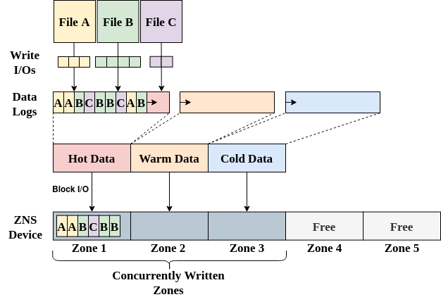

# msF2FS

msF2FS is an optimized version of F2FS meant to enhance utilization of ZNS SSD by leveraging an increased parallelism with concurrent data logs across zones, and provide applications with a new way of managing data placement. By default, F2FS has 3 data logs (hot/warm/cold), which all have a section in which their data is being written to the log. With msF2FS, we extend this concept to have __streams__ for each of the data logs. Therefore, opening more zones with concurrently writable data logs for the same lifetime classification. This is a configurable option of msF2FS, specified at mount time on the number of streams that are desired for each of the lifetime classifications, allowing to be configured based on the workload (application running on msF2FS) write characteristics. For detailed information about msF2FS implementation and evaluation, consult the final thesis report available [here](https://repository.tudelft.nl/islandora/object/uuid%3A3c2b3e73-6aff-45f3-af43-31a50314b547?collection=education). 

**NOTE**, msF2FS is **EXPERIMENTAL** and does not support crash recovery or streams in the checkpoint. We therefore recommend to **ONLY** use this for research purposes at the moment, and **not** in production.

## Stream Mapping

The blow figure illustrates the default F2FS mapping in the case of three hot data files, where blocks are allocated in the single hot data log.



With msF2FS, we now can map each of the files to a different stream for the hot data logs. This will not only result in higher performance, from utilizing more of the ZNS zones concurrently, but also help reduce future garbage collection overheads by decreasing intra-file fragmentation.


### Stream Allocation Policy

There are several options on how msF2FS allocates data blocks among the available streams. These are configured at mount time.

#### Stream Round Robin (SRR)

This is a naive approach that allocates blocks, independent of file, in a round-robin fashion on the available streams in that lifetime classification. This however results in significant fragmentation, as files are not allocated continuously. We therefore recommend to mostly use the next policy.

#### Stream Pinned Files (SPF)

This policy assigns a stream to each file on the first block allocation it does for that file. The stream to be assigned is decided in round-robin fashion, however once a file is assigned a stream, its data is only ever allocated in that stream (unless GC moves it which can map it to a different stream, or the file system runs out of space, in which case it uses first-fit policy among the streams). This information is stored in the VFS inode, and is therefore __not__ persistent.

Since multiple files can be mapped to the same stream, this policy has the option for an application to set a flag in the inode that exclusively reserves a stream for only this file. All other files mapped to this stream are then migrated to the next available stream (after the current one) in round-robin. The migrated file will then only be written to the newly assigned stream, and new file allocates cannot go onto the reserved stream. Since there must always be at least one stream available, stream 0 cannot be reserved (GC is also writing to this stream). This option utilizes `fcntl()` and can be set as follows:

```c
#define F_LINUX_SPECIFIC_BASE 1024
#define F_SET_EXCLUSIVE_DATA_STREAM (F_LINUX_SPECIFIC_BASE + 15)
#define F_UNSET_EXCLUSIVE_DATA_STREAM (F_LINUX_SPECIFIC_BASE + 16)

/* .... Some code here for a program .... */

/* set the exclusive stream on an open file fd */
if (fcntl(out, F_UNSET_EXCLUSIVE_DATA_STREAM) < 0) {
    if (errno == EINVAL) {
        ERR_MSG("F_UNSET_EXCLUSIVE_DATA_STREAM not supported\n");
    }
}
```

#### Application Managed File Streams (AMFS)

This policy gives full control of stream mappings to the host application. It does this by mapping each file by default to stream 0, unless the host application provides a bitmap, with the bits set on which streams the file shall be mapped to. The streams that are supplied are then utilized in a fashion that aims to fill a segment and then move to the next segment whose bit is set in the bitmap. Therefore, allowing to decrease fragmentation if multiple streams are set.

In order to provide the bitmap from the application, `fcntl()` is used with the `F_SET_DATA_STREAM_MAP` option, which takes a bitmap as an argument. Below we have an example utilizing this, where a full example can also be seen in [zns-tools fpbench.h](https://github.com/nicktehrany/zns-tools/blob/master/src/fpbench.h#L29) and [zns-tools fpbench.c](https://github.com/nicktehrany/zns-tools/blob/master/src/fpbench.c#L117-#L126).

```c
#define F_LINUX_SPECIFIC_BASE 1024
#define F_SET_DATA_STREAM_MAP (F_LINUX_SPECIFIC_BASE + 17)

/* .... Some code here for a program .... */

unsigned long *streammap = 0;

/* set a bit in the map */
*streammap |= (1 << 2);

/* set the bitmap on an open file fd */
if (fcntl(out, F_SET_DATA_STREAM_MAP, streammap) < 0) {
    if (errno == EINVAL) {
        ERR_MSG("F_SET_DATA_STREAM_MAP Invalid Argument\n");
    }
}
```

## Compiling msF2FS

msF2FS is built right into the F2FS source code, hence compilation is as with any normal Kernel, only requiring the multi-streamed option to be enabled. The steps for these are as follows (assuming we'll just copy the Kernel config file from the currently running kernel). This is just an example that builds .dep packages which are copied to a VM and installed there, feel free to build the Kernel however desired, it only requires the multi-streamed data logging to be enabled for F2FS. If there are other issues during build, check the [Debugging](#Debugging) section.

```bash
cp /usr/src/linux-headers-$(uname -r)/.config .config
make menuconfig

# Scroll to File Systems ---> F2FS and enable "F2FS multi-streamed data logging (EXPERIMENTAL)"

# build deb packages
make -j10 bindeb-pkg LOCALVERSION=-msf2fs

# Files are in parent dir
cd ..
# Remove the -dbg image if present, change version number to yours!
rm linux-image-5.19.0-msf2fs-dbg_5.19.0-msf2fs-66_amd64.deb

# copy to host VM machine (Adjust user/system info)
scp -P 8888 *.deb user@localhost:~/src/f2fs-build-debs/

# Install in VM
sudo dpkg -i *.deb

# Reboot the VM
sudo reboot
```

## Setting up msF2FS Streams

There are several parameters that specify the number of data streams to use and the stream allocation policy. The policy is provided by setting either of the acronyms as the policy (srr, spf, amfs). The default `mkfs.f2fs` can be used to format the device (available at: https://git.kernel.org/pub/scm/linux/kernel/git/jaegeuk/f2fs-tools.git).

This is only an example, replace the command with $ZNS and $SSD device names, and desired number of streams. Any stream that is not specified will default to 1. Streams are specified with `-o {hot/warm/cold}_data_streams=` and the policy with `-o stream_policy={srr,spf,amfs}`

```
sudo mkfs.f2fs -f -m -c /dev/${ZNS} /dev/${SSD}
sudo mkdir -p /mnt/f2fs
sudo mount -t f2fs -o hot_data_streams=${HOT_DATA_STREAMS} -o warm_data_streams=${WARM_DATA_STREAMS} \
    -o cold_data_streams=${COLD_DATA_STREAMS} -o stream_policy=spf /dev/${SSD} /mnt/f2fs

# For convenience change dir owner
sudo chown -R ${USER} /mnt/f2fs
```

## msF2FS Stream Info

msF2FS also provides detailed information on the operations of streams. For this we require debugfs to be enabled in the Kernel build (in order to get F2FS statistics). We can then extract information with (needs to be run as root)

```bash
sudo su
cat /sys/kernel/debug/f2fs/status 
```

### Example information

This shows an example information of msF2FS stream information:

```bash
root@stosys:/home/user# cat /sys/kernel/debug/f2fs/status | grep -A40 -i "multi"
    Multi-Stream INFO:
  - Stream Allocation:
         Policy: SPF
  - Maximum Streams: 9
  - Active Streams: 9
  - STREAMS:
        Maximum:  [  4  1  1  1  1  1  ]
         Active:  [  4  1  1  1  1  1  ]
      EXCLUSIVE:  [  0  0  0  0  0  0  ]
  - ACTIVE STREAM BITMAPS:
       HOT_DATA   [ 1 1 1 1 ]
       WARM_DATA  [ 1 0 0 0 ]
       COLD_DATA  [ 1 0 0 0 ]
       HOT_NODE   [ 1 0 0 0 ]
       WARM_NODE  [ 1 0 0 0 ]
       COLD_NODE  [ 1 0 0 0 ]
  - EXCLUSIVE STREAM BITMAPS:
       HOT_DATA   [ - 0 0 0 ]
       WARM_DATA  [ - ]
       COLD_DATA  [ - ]
       HOT_NODE   [ - ]
       WARM_NODE  [ - ]
       COLD_NODE  [ - ]
  - EXCLUSIVE STREAM INO-MAP:
       HOT_DATA   [ - 0 0 0 ]
       WARM_DATA  [ - ]
       COLD_DATA  [ - ]
       HOT_NODE   [ - ]
       WARM_NODE  [ - ]
       COLD_NODE  [ - ]

    TYPE       STREAM    segno    secno   zoneno  dirty_seg   full_seg  valid_blk
  - HOT  data:      0    49611       48       48          1        459     235012
  - HOT  data:      1    46523       45       45          1        443     227084
  - HOT  data:      2    47548       46       46          1        444     227508
  - HOT  data:      3    48569       47       47          1        441     226188
  - WARM data:      0     4096        4        4          0          0          0
  - COLD data:      0    45594       44       44         40      21520   11028479
  - HOT  node:      0        0        0        0          1          0          1
  - WARM node:      0     1180        1        1         35          4      15452
  - COLD node:      0     2048        2        2          1          0         20
```


## Debugging

If there are issues with keys during the Kernel build simply run, which will cause the build to cleanly generate keys during the next build.

```
scripts/config --disable SYSTEM_TRUSTED_KEYS
scripts/config --disable SYSTEM_REVOCATION_KEYS
```
